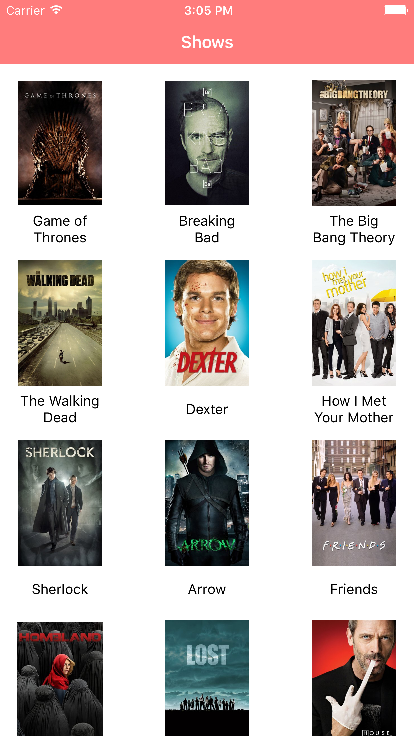
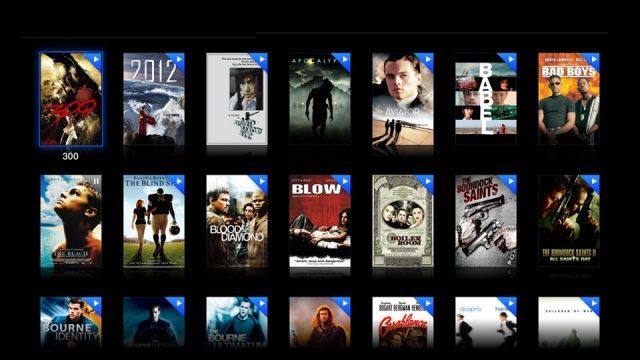
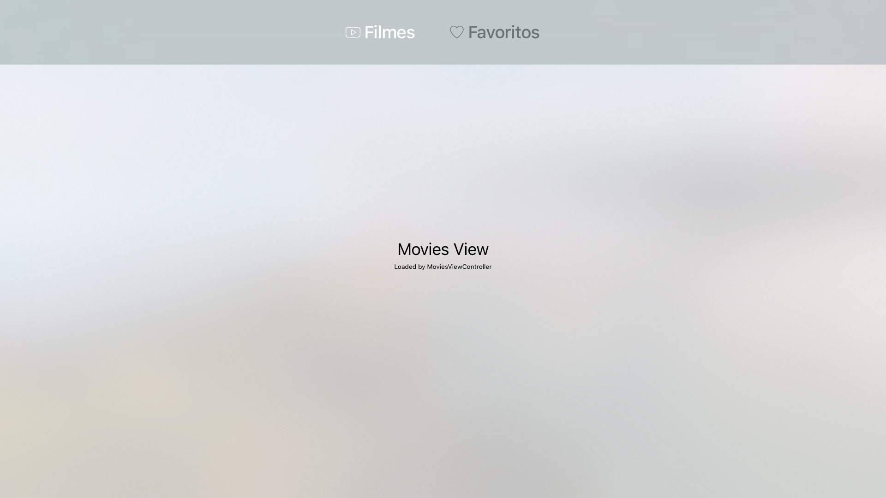

# Workshop: Criando aplicativos para a nova Apple TV

---

# Criar versão para tvOS

Seguir as guidelines apresentadas, para criar a versão tvOS de uma app de filmes.

 

---

# Tarefas

- Exibir lista de filmes na primeira aba
- Exibir o título somente do item que estiver em foco
- Implementar efeito parallax para o item selecionado
- Exibir informações do item selecionado em uma nova tela
- Esconder/exibir o menu pelo movimento de swipe do controle

---

# Bônus

- Implementar botão para avaliar o filme selecionado (1 a 5 estrelas)
- Implementar botão de favoritos
- Exibir itens favoritos na segunda aba

---

# O que já temos

- Base project
- Camada Model com serviços implementados
- Versão iOS para consultas caso necessário
- App configurada para rodar na Apple TV

---

# [fit] Dúvidas?